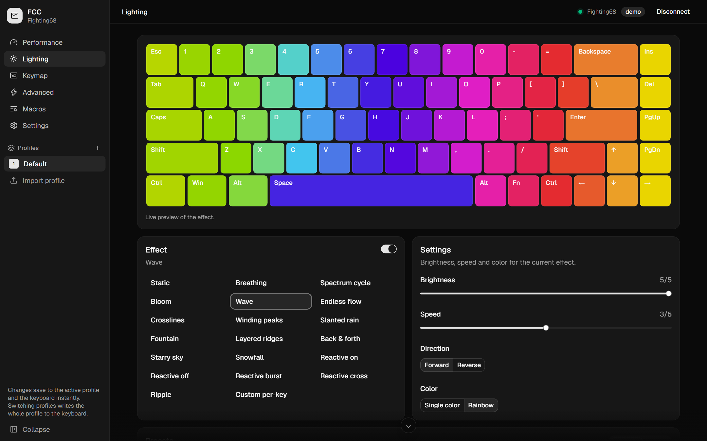
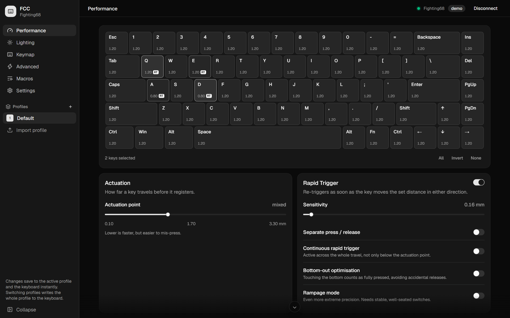
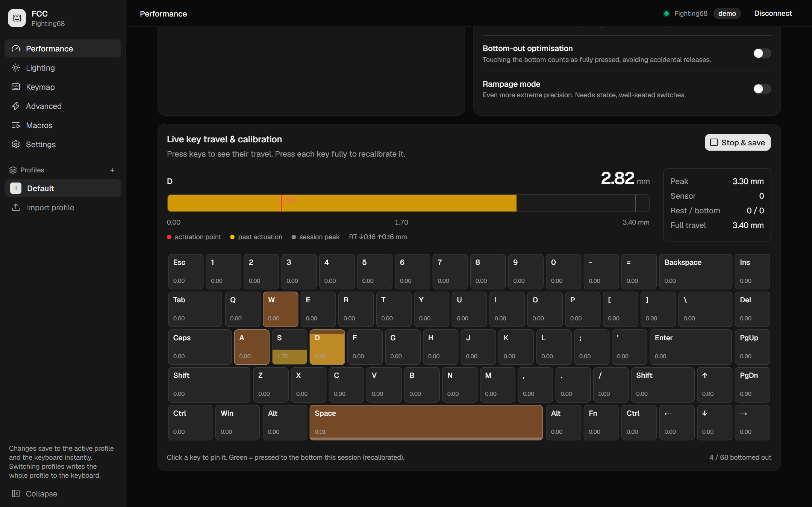
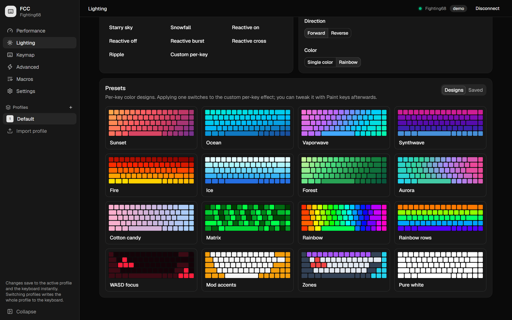
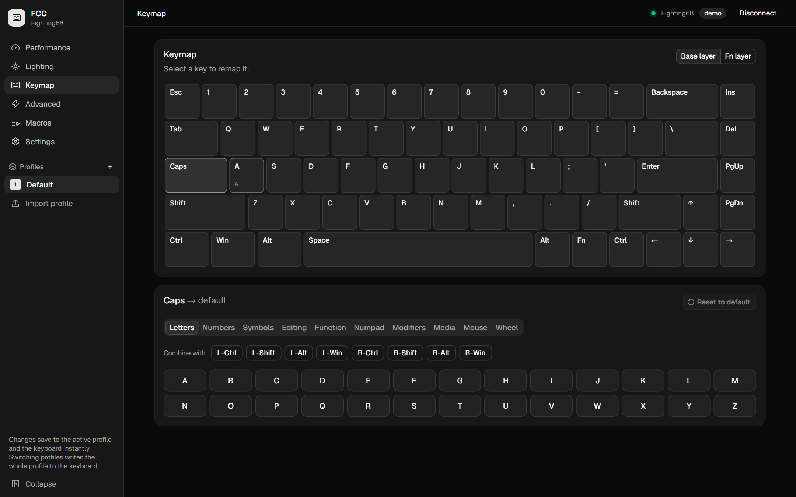
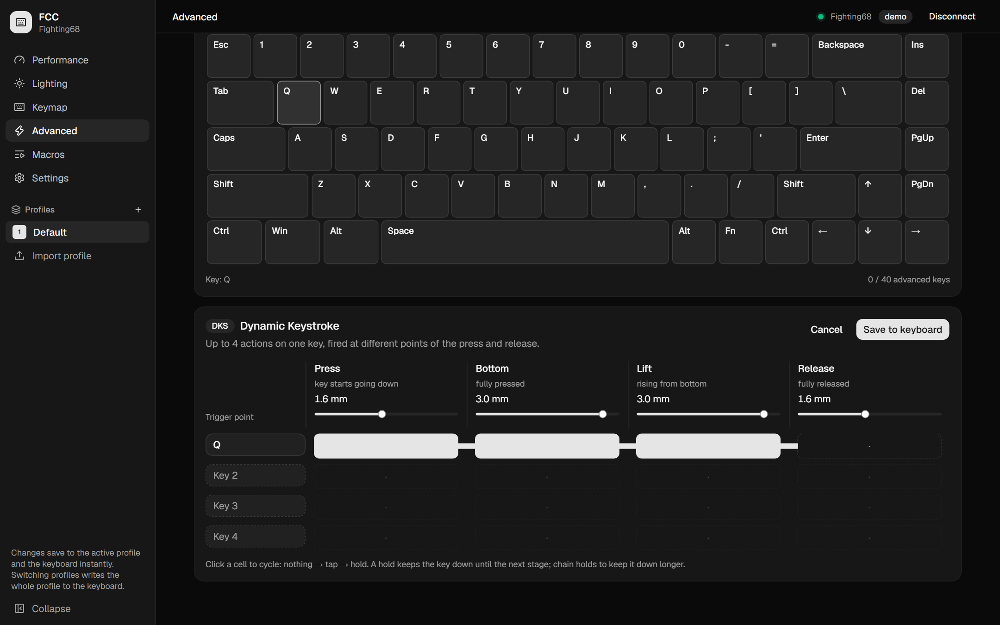
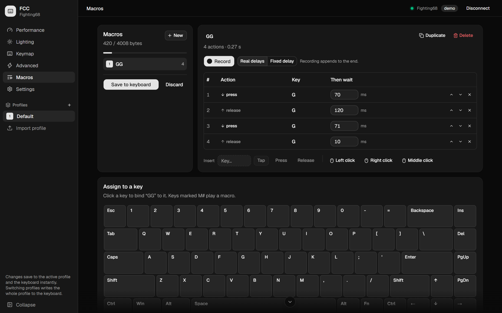
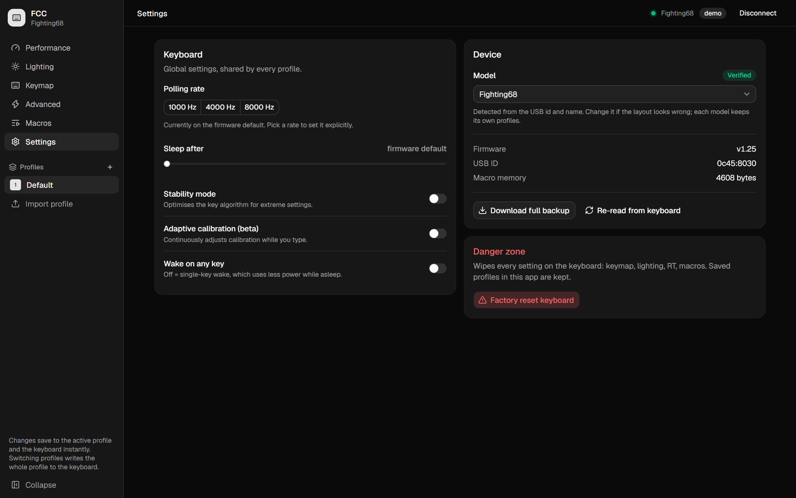

<div align="center">

# Fighting Control Center

**A fast, modern configurator for hall-effect keyboards.**
Built for the Fekker × VTER **Fighting68 HE**, with support for ~150 Sonix-based HE boards.

Rapid trigger · Live key travel · Lighting · Remapping · Advanced keys · Macros · Profiles

Windows desktop app (Tauri, ~2 MB) and a web version (Chrome / Edge)



</div>

---

## Why

The official VTER web driver works, but it's slow, cluttered and easy to get lost in. FCC is a from-scratch
replacement: the same keyboard protocol (reverse-engineered and documented in [docs/PROTOCOL.md](docs/PROTOCOL.md)),
wrapped in a clean, dark, keyboard-first UI, plus the things a desktop app should have: profiles you can switch
mid-game, a tray icon, hotkeys and per-game auto-switching.

## Features

### Performance & rapid trigger

Per-key actuation, rapid trigger with separate press/release sensitivity, continuous RT, bottom-out optimisation
and rampage mode. Select one key, a few, or the whole board.



### Live key travel

See exactly how far every key is pressed, in 0.01 mm, with your actuation point and rapid-trigger distances on the
gauge. Doubles as travel calibration.



### Lighting

All 19 firmware effects with a live on-screen preview (reactive effects respond to your typing), brightness,
speed, direction, single colour or rainbow, and per-key painting.



16 built-in per-key designs (Sunset, Vaporwave, Fire, WASD focus…) and your own saved lighting presets.

### Keymap

Remap any key to another key, key + modifier combos, media keys, mouse buttons or the scroll wheel.



### Advanced keys

**Rappy Snappy**, **SOCD** (last input, key 1 / key 2 priority, neutral), **Dynamic Keystroke** (4 keys × 4 stages,
tap or hold, per-stage trigger points), **Mod-Tap** and **Toggle**.



### Macros

Record with real or fixed delays, edit and reorder every action, insert keys and mouse clicks, watch the memory
meter, and bind to a key: play once, repeat N times, or until pressed again.



### Profiles & desktop app

- **Unlimited profiles**, switched from the sidebar, the **tray**, **global hotkeys** (Ctrl+Alt+1…9) or
  **automatically when a game is focused** (and back when you leave it)
- **On-screen popup** shows the new profile over your game, without ever stealing focus
- **Start with Windows** quietly in the tray; close-to-tray; single instance
- Switching only rewrites what differs on the keyboard, so it's near-instant
- Import / export profiles as files

### Settings

Polling rate (up to 8 kHz), sleep, stability mode, adaptive calibration, wake mode, full backup and factory reset.



## Supported keyboards

| Status | Boards | |
|---|---|---|
| ✅ Verified | **Fighting68 HE** (`0c45:8030`) | Tested end to end on real hardware |
| ⚠️ Untested | 135 wired boards: AULA F65, Ajazz AK820 MAX, EWEADN BAT68, Royal Kludge RK-series, MCHOSE, Looting, QSENN, Epomaker HE80, LEOBOG… | Detected automatically; open **read-only** until you choose *Allow changes* |
| ⛔ Not yet | Wireless 2.4 GHz dongles | Use the USB cable instead |

They all use the same Sonix-based firmware behind the official driver, so they *should* work. The full list with
USB ids and switch limits is in **[docs/DEVICES.md](docs/DEVICES.md)**. If you try FCC on one of them, please open an
issue saying whether it worked so it can be marked verified.

## Install

**Windows:** download `Fighting Control Center_x64-setup.exe` from [Releases](../../releases) and run it.
The installer isn't code-signed yet, so SmartScreen may warn you: *More info → Run anyway*.

**Browser:** run the web version (below) in Chrome or Edge; no install needed.

## Build from source

Requirements: Node.js 20+, and for the desktop app, Rust and the Microsoft C++ build tools.

```bash
git clone https://github.com/shybruh/FightingControlCenter.git
cd FightingControlCenter
npm --prefix app install

npm --prefix app run dev              # web version on http://localhost:5174
npm --prefix app run desktop          # desktop app with hot reload
npm --prefix app run desktop:build    # release build + installer (app/src-tauri/target/release/bundle/nsis)
```

No keyboard handy? Click **Try demo mode** for a simulated board.

## Safety

FCC writes to your keyboard's memory, so it's deliberately careful:

- Only the commands the official driver itself sends are used. **There is no firmware-flashing code.**
- Every packet waits for the keyboard's acknowledgement; writes are serialized and never interleave.
- All values are clamped to each board's limits before encoding; unknown bytes are preserved.
- A full backup of the keyboard is taken on every connect.
- Untested boards start read-only. The Fn key can't be remapped. Factory reset is always one click away.

## Tech

React 19 · TypeScript · Vite · Tailwind CSS 4 · shadcn/ui · zustand · Tauri 2 (Rust, hidapi) · WebHID

```
app/src/hid/        protocol, transports (WebHID / Tauri / demo), device queue, codecs
app/src/devices/    keyboard catalogue + detection
app/src/components/ pages and UI
app/src-tauri/      desktop shell: native HID bridge, tray, hotkeys, popup
docs/               protocol notes, supported devices, screenshots
tools/catalog/      scripts that regenerate the device catalogue
```

## Disclaimer

Fighting Control Center is an independent project and is not affiliated with Fekker, VTER, Sonix or any keyboard
brand listed here. Use it at your own risk; a factory reset from the app (or the keyboard) restores default settings.
